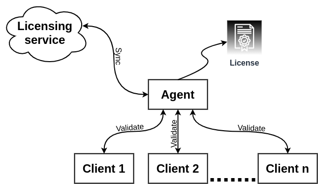

# Mainflux Licensing Service

[![coverage][cov-badge]][cov-url]
![build][build-badge]

Licensing service

[cov-badge]: https://codecov.io/gh/mainflux/license/branch/master/graph/badge.svg
[cov-url]: https://codecov.io/gh/mainflux/license
[build-badge]: https://github.com/mainflux/license/workflows/build/badge.svg

# Concepts
License is used to validate a service on startup. License entity looks like this:

```go
type License struct {
	ID        string                 `json:"id"`
	Key       string                 `json:"key"`
	Issuer    string                 `json:"issuer"`
	DeviceID  string                 `json:"device_id"`
	Active    bool                   `json:"active"`
	CreatedAt time.Time              `json:"created_at"`
	ExpiresAt time.Time              `json:"expires_at"`
	UpdatedBy string                 `json:"updated_by"`
	UpdatedAt time.Time              `json:"updated_at"`
	Services  []string               `json:"services"`
	Plan      map[string]interface{} `json:"plan"`
	Signature []byte                 `json:"signature"`
}
```
> Please note that some of these fields are not used at the moment and are hare for the future use.

The licensing flow has two parts: `service` and `agent`.

# Licensing service

Licensing service provides basic CRUD operations over License.

The service is configured using the environment variables presented in the
following table. Note that any unset variables will be replaced with their
default values.

| Variable                    | Description               | Default        |
| --------------------------- | ------------------------- | -------------- |
| MF_LICENSE_LOG_LEVEL        | License service log level | error          |
| MF_LICENSE_DB_HOST          | DB host                   | localhost      |
| MF_LICENSE_DB_PORT          | DB port                   | 5432           |
| MF_LICENSE_DB_USER          | DB user                   | mainflux       |
| MF_LICENSE_DB_PASS          | DB pass                   | mainflux       |
| MF_LICENSE_DB               | DB name                   | license        |
| MF_LICENSE_DB_SSL_MODE      | DB SSL mode               | disable        |
| MF_LICENSE_DB_SSL_CERT      | DB SSL cert in PEM        |                |
| MF_LICENSE_DB_SSL_KEY       | DB SSL key                |                |
| MF_LICENSE_DB_SSL_ROOT_CERT | DB SSL root cert          |                |
| MF_LICENSE_CLIENT_TLS       | Client TLS                | false          |
| MF_LICENSE_CA_CERTS         | gRPC CA cert              |                |
| MF_LICENSE_PORT             | service HTTP port         | 8111           |
| MF_LICENSE_SERVER_CERT      | server TLS cert           |                |
| MF_LICENSE_SERVER_KEY       | server TLS cert key       |                |
| MF_JAEGER_URL               | tracing URL               |                |
| MF_AUTH_URL                 | Auth service URL          | localhost:8181 |
| MF_AUTH_TIMEOUT             | Auth service call timeout | 1              |


# Licensing Agent

The agent is an executable that's running on local machine and is used for license validation and synchronization with the service. 

The agent is configured using the environment variables presented in the
following table. Note that any unset variables will be replaced with their
default values.

| Variable                    | Description                                                       | Default                                  |
| --------------------------- | ----------------------------------------------------------------- | ---------------------------------------- |
| MF_LICENSE_LOG_LEVEL        | Agent log level                                                   | "error"                                  |
| MF_LICENSE_SERVICE_URL      | License service URL                                               | "http://localhost:8111/licenses/devices" |
| LICENSE_FILE                | File to store license in                                          | "./license"                              |
| MF_LICENSE_CLIENT_TLS       | HTTP client for License service                                   | "false"                                  |
| MF_LICENSE_AGENT_CERT       | Agent  TLS cert                                                   |                                          |
| MF_AGENT_SERVER_KEY         | Agen  TLS cert key                                                |                                          |
| MF_AGENT_PORT               | Agent port                                                        | "3000"                                   |
| MF_AGENT_LOAD_RETRY_SECONDS | Retry period in seconds to wait between two sync calls to service | "60"                                     |

The Agent fetches the License using its ID, and exposes HTTP API for validation. You can se the License validation flow on the diagram below:

